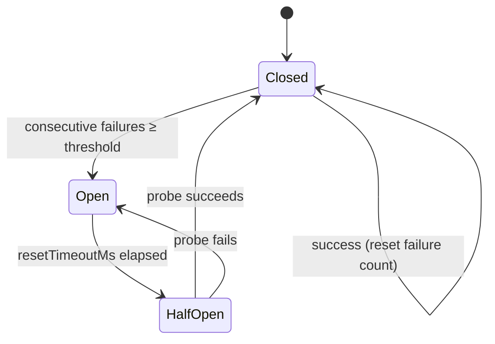

# @aadiaiagent/resilience-kit

**Reliability primitives for Node.js** — CircuitBreaker, retry with exponential backoff + full jitter, Timeout, and Bulkhead. Zero runtime dependencies. ESM. MIT.

Production-minded fault-tolerance patterns: fail-fast isolation, controlled retries, and dependency protection without a heavy framework. Small surface area — readable in one sitting.

---

## Why this exists

Reliable services need clear answers for:

1. *When* to trip a circuit vs. when to retry.
2. Preferring fail-fast bulkheads over unbounded queues.
3. Choosing full jitter over naïve exponential backoff (AWS Architecture Blog).
4. Shipping typed, tested, dependency-light libraries that compose cleanly.

This kit is that toolkit — small, composable, production-shaped.

---

## Primitives

| Primitive | Role |
|-----------|------|
| **CircuitBreaker** | Protect downstreams: closed → open → half-open |
| **retry** | Transient-fault recovery with full-jitter backoff |
| **withTimeout** | Wall-clock deadline; rejects with `TimeoutError` |
| **Bulkhead** | Concurrency ceiling; rejects when saturated |

---

## Circuit breaker state machine



---

## Quickstart

```bash
npm install @aadiaiagent/resilience-kit
# or clone & develop:
npm install && npm run typecheck && npm test && npm run example
```

```ts
import {
  retry,
  CircuitBreaker,
  withTimeout,
  Bulkhead,
} from "@aadiaiagent/resilience-kit";

// Retry with full jitter
const data = await retry(() => fetchJson("/api"), {
  retries: 3,
  baseMs: 100,
  maxMs: 5_000,
  shouldRetry: (err) => err instanceof TypeError,
});

// Circuit breaker around a flaky dependency
const cb = new CircuitBreaker({ failureThreshold: 5, resetTimeoutMs: 30_000 });
const result = await cb.execute(() => callDownstream());

// Deadline
const value = await withTimeout(slowWork(), 2_000);

// Concurrency limit (fail-fast, no queue)
const bh = new Bulkhead({ maxConcurrent: 10 });
await bh.execute(() => handleRequest());
```

Compose them:

```ts
await bh.execute(() =>
  cb.execute(() =>
    withTimeout(
      retry(() => callDownstream(), { retries: 2, baseMs: 50, maxMs: 500 }),
      3_000,
    ),
  ),
);
```

---

## Design choices

| Choice | Rationale |
|--------|-----------|
| **Full jitter** (`random(0, min(maxMs, base × 2ⁿ))`) | Desynchronises clients better than equal/decorrelated jitter for typical client retry storms. |
| **Fail-fast bulkhead** (reject, don't queue) | Queues hide overload and create unbounded latency; prefer shedding load early. |
| **Lazy open → half-open** | Transition checked on `getState()` / `execute()` — no background timers, simpler for serverless / short-lived processes. |
| **No AbortController inside Timeout** | Promises aren't cancellable by default; callers own abort semantics so we don't pretend to cancel work. |
| **Zero runtime deps** | Auditable surface area; only `typescript` / `vitest` / `tsx` as devDeps. |
| **NodeNext + ESM + strict** | Matches modern Node 20+ packaging; `exactOptionalPropertyTypes` catches real API footguns. |

---

## Layout

```
resilience-kit/
├── src/
│   ├── types.ts            # Shared types + typed errors
│   ├── retry.ts            # Exponential backoff + full jitter
│   ├── circuitBreaker.ts   # Three-state circuit breaker
│   ├── timeout.ts          # withTimeout(promise, ms)
│   ├── bulkhead.ts         # Concurrency-limiting bulkhead
│   └── index.ts            # Public exports
├── tests/                  # Vitest coverage of each primitive
├── examples/basic.ts       # Runnable walkthrough
├── .github/workflows/ci.yml
├── package.json
├── tsconfig.json
└── LICENSE                 # MIT © 2026 aadiaiagent-max
```

---

## Scripts

| Script | What it does |
|--------|----------------|
| `npm run build` | Emit `dist/` (JS + `.d.ts`) |
| `npm run typecheck` | Strict `tsc --noEmit` |
| `npm test` | Vitest suite |
| `npm run example` | Run `examples/basic.ts` via tsx |

---

## Roadmap

- [ ] Sliding-window failure rate (in addition to consecutive-failure threshold)
- [ ] Optional wait-queue mode for Bulkhead with maxWaitMs
- [ ] Metrics hooks (`onStateChange`, `onRetry`) for OpenTelemetry / StatsD
- [ ] Adaptive timeout based on recent latency percentiles
- [ ] Deno / edge runtime smoke tests

---

## Requirements

- Node.js **≥ 20**
- ESM only (`"type": "module"`)

---

## License

MIT © 2026 [aadiaiagent-max](https://github.com/aadiaiagent-max)
